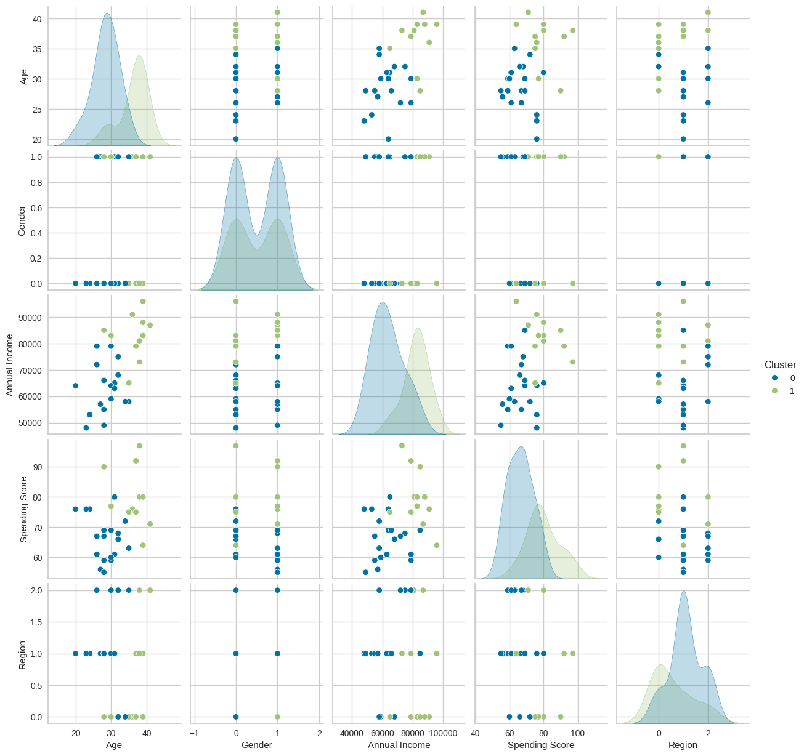

# Clustering Project

This markdown file outlines a clustering project using Python's scikit-learn library. The project involves exploring a dataset, preprocessing the data, applying KMeans clustering algorithm, and visualizing the clustering results.

## Steps:

1. **Data Loading**: The project starts by loading the dataset (`customer_data.csv`) into a pandas DataFrame.

2. **Exploratory Data Analysis (EDA)**: Exploratory analysis is performed to understand the structure and characteristics of the dataset. This includes examining the data types, summary statistics, and visualizing the data using pairplots.

3. **Data Preprocessing**: Missing values are handled by dropping rows with missing values. Categorical variables are encoded using LabelEncoder, and numerical variables are standardized using StandardScaler.

4. **Clustering**: KMeans clustering algorithm is applied to the preprocessed data to identify natural groupings within the dataset. The optimal number of clusters is determined using silhouette scores.

5. **Visualizing Clustering Results**: The clustering results are visualized using pairplots to observe the distribution of clusters in the data space. Cluster centroids for numerical features are also plotted to understand the characteristics of each cluster.

6. **Validating Clustering**: The quality of clustering is validated using silhouette visualization, which measures the cohesion and separation of clusters.

7. **Implementing Segmentation Strategy**: The clustering results can be applied to real-world business processes such as customer segmentation to drive decision-making.

## Results:

### Pairplot of Clustering Results

